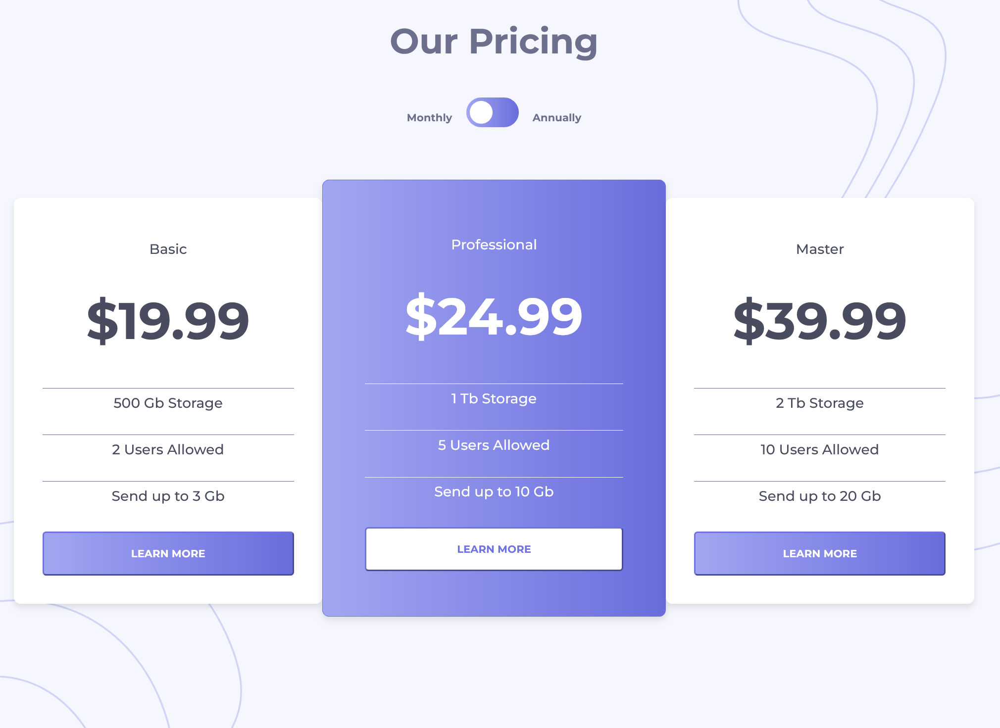

# Frontend Mentor - Pricing component with toggle solution

This is a solution to the [Pricing component with toggle challenge on Frontend Mentor](https://www.frontendmentor.io/challenges/pricing-component-with-toggle-8vPwRMIC). Frontend Mentor challenges help you improve your coding skills by building realistic projects.

### Screenshot

### Links

- Solution URL: https://github.com/cgojk/pricing_component.git
- Live Site URL:https://bejewelled-marigold-1d88f4.netlify.app/

## My process

### Built with

- Semantic HTML5 markup
- CSS custom properties
- Flexbox
- CSS Grid
- Mobile-first workflow
- [React](https://reactjs.org/) - JS library

### What I learn

Pseudo-class selectors to select a specific type of card among its siblings and create the overlapping effect.
Continued using React, which I really enjoy learning about.
Continued development

### continue learning

Continue developing my understanding of JavaScript while keeping track of different aspects of CSS and SCSS.

### Useful resources

W3Schools — I used it to learn how to create the toggle.

## Author

-Catalina G.
